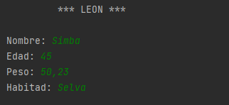

La aplicación que estamos desarrollando tiene como temática principal los felinos. El objetivo es implementar un programa que permita ingresar y almacenar información sobre felinos de diferentes especies. Para lograr esto, utilizaremos un diagrama UML para representar la estructura de la clase "Felino" y luego implementaremos la aplicación en lenguaje Java.

